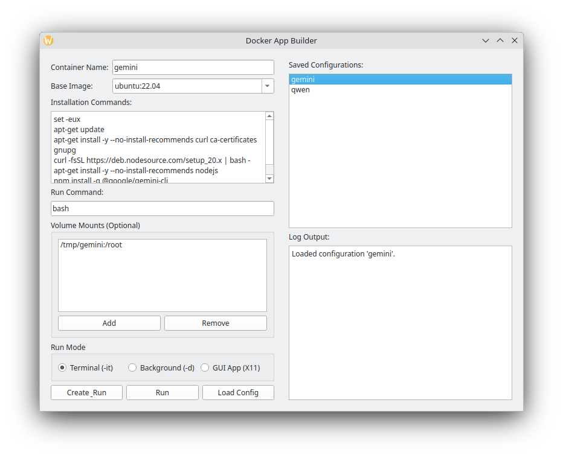

# Docker App Builder

The **Docker App Builder** is a versatile desktop application for Linux designed to streamline the process of defining, building, and running Docker containers. It aims to simplify Docker workflows for both developers and users of containerized applications by providing:

*   **Intuitive Configuration:** A user-friendly interface (GUI) to easily specify container names, base images, installation commands, run commands, and volume mounts, abstracting away complex Docker CLI syntax.
*   **Persistent Configurations:** The ability to save and load container configurations, ensuring consistency and reproducibility across sessions and for different projects.
*   **Flexible Execution Modes:** Support for running containers in various modes: interactive terminal sessions for CLI applications, background for services, and securely sandboxed GUI applications with automatic X11 forwarding.
*   **Seamless Integration:** Offers both a graphical interface for visual management and a powerful command-line interface (CLI) for scripting and automation, catering to diverse user preferences and workflows.
*   **Simplified Distribution:** Tools to build standalone executables, allowing the application and its configurations to be easily distributed and run on systems without a full Python environment.
*   **Enhanced Security and Isolation:** Enables secure execution of command-line tools and AI agents (like `gemini-cli` or `qwen-code`) by leveraging Docker's filesystem isolation. Users can precisely control host filesystem access via volume mounts, preventing unintended data exposure or modification.

## Prerequisites

- Python 3.9+
- `python3-venv` package (or equivalent for your distribution)
- Docker Engine (must be installed and running)

## Setup

1.  **Clone the repository (or download the source code).**

2.  **Create and activate a Python virtual environment:**
    ```bash
    python3 -m venv venv
    ```

3.  **Install the required dependencies:**
    ```bash
    ./venv/bin/pip install PyQt6 docker
    ```

## Building an Executable

You can create a standalone executable for the Docker App Builder using the provided `build.sh` script. This allows you to run the application on systems that don't have Python or its dependencies installed.

1.  **Make the build script executable (if not already):**
    ```bash
    chmod +x build.sh
    ```
2.  **Run the build script:**
    ```bash
    ./build.sh
    ```
    This process will install PyInstaller (if not already present), clean up previous build artifacts, and then package the application.
3.  **Run the executable:**
    Once the build is complete, you will find the `DockerAppBuilder` executable in the `dist/` directory.
    ```bash
    ./dist/DockerAppBuilder
    ```
    You can then run this executable directly.

## How to Run (GUI)

To launch the graphical interface, run the script with no arguments:
```bash
./venv/bin/python3 docker_app_builder/main.py
```



## How to Use (GUI)

1.  **Fill out the form:**
    -   **Container Name:** A unique name for your container (e.g., `my-test-app`).
    -   **Base Image:** The Docker image to build upon (e.g., `ubuntu:22.04`).
    -   **Installation Commands:** A list of shell commands for the build.
    -   **Run Command:** The command to execute when the container starts.
    -   **Volume Mounts (Optional):** Add multiple volumes by specifying a **Host Path** on your computer and a **Container Path** inside the Docker container. If any volumes are mounted, the **Run Command** will execute from within the *first* mounted volume's directory inside the container by default.
    -   **Run Mode:** Choose `Terminal` for CLI apps, `Background` for services, or `GUI App` for graphical applications.

2.  **Create & Rebuild:**
    -   Click the **Create & Run** button to build the image (using cache if available), save the configuration, and run the container.
    -   Click the **Rebuild** button to force a clean build of the image (ignoring cache), save the configuration, and run the container.

3.  **Load and Run Existing Configs:**
    -   Previously created configurations are listed on the right.
    -   Click a configuration name to load its settings.
    -   Click the **Run** button to launch a container using the loaded settings. An existing container with the same name will be removed first.

**Note for GUI Apps and Sandboxing:**
When you choose the `GUI App` mode, the Docker App Builder configures the container to allow graphical applications to display on your host system. This is achieved through X11 forwarding, which securely bridges the container's graphical output to your local X server.

Crucially, the GUI application itself still runs *inside* a Docker container, inheriting the same sandboxing benefits as CLI applications. This means:
*   **Filesystem Isolation:** Unless explicitly mounted using the "Volume Mounts" feature, the GUI application within the container has no access to your host's files.
*   **Limited Host Interaction:** The primary interaction with your host system is limited to displaying its graphical interface.
*   **Controlled X Server Access:** The application automatically attempts to forward your X11 socket and `.Xauthority` file. In some environments, especially when connecting to a remote X server or if you encounter display issues, you might need to manually grant the Docker daemon permission to connect to your X server. This is typically done by running `xhost +local:docker` on your host *before* launching the container. This command grants access *only* to processes originating from the local Docker daemon, maintaining a controlled environment compared to `xhost +` which grants universal access. Always remove this permission with `xhost -local:docker` when no longer needed if you previously added it.

This setup ensures that your GUI applications run in an isolated environment, minimizing their potential impact on your host system while still providing a seamless graphical experience.

## A Note on Security and Sandboxing

Running command-line tools and agents like `gemini-cli` or `qwen-code` inside a Docker container provides a significant security advantage. By default, a Docker container is isolated from your computer's filesystem. It cannot see, modify, or delete any of your personal files.

The only way for a container to access your host filesystem is through an explicit **volume mount** (using the `--volume` flag or the "Volume Mounts" feature in the GUI). This gives you precise control over what the containerized application can access.

For example, when you run `gemini-cli` and mount only its configuration directory (`--volume "$HOME/.gemini:/root/.gemini"`), you are granting it access to *only that specific folder*. The agent can read and write its own settings and history, but it remains completely sandboxed from the rest of your home directory and system files.

This approach allows you to use these powerful tools without worrying about them accidentally deleting important files or accessing sensitive data outside of their intended scope.

## Command-Line Usage (CLI)

You can also create and run containers directly from the command line.

### Examples

#### 1. Installing and Running `gemini-cli`

This example shows how to create a container with Node.js and the `@google/gemini-cli` installed. A volume is mounted to persist the `gemini-cli` configuration.

```bash
./venv/bin/python3 docker_app_builder/main.py create --name gemini-cli-app \
--base-image "ubuntu:22.04" \
--install-commands "apt-get update" \
"apt-get install -y --no-install-recommends curl ca-certificates gnupg" \
"curl -fsSL https://deb.nodesource.com/setup_20.x | bash -" \
"apt-get install -y --no-install-recommends nodejs" \
"npm install -g @google/gemini-cli" \
--run-command "bash" \
--volume "$HOME/.gemini:/root/.gemini" \
--mode terminal \
--run
```

**Explanation:**
- `apt-get` commands install prerequisites for Node.js.
- Node.js is installed from `nodesource`.
- `gemini-cli` is installed globally via `npm`.
- `run-command "bash"` provides an interactive shell upon container launch.
- `--volume "$HOME/.gemini:/root/.gemini"` mounts your host's `.gemini` config directory to the container's root user's `.gemini` directory, ensuring CLI configurations (like `gemini configure`) persist.

To run this saved configuration later:
```bash
./venv/bin/python3 docker_app_builder/main.py run gemini-cli-app
```

#### 2. Installing and Running `qwen-code`

This example shows how to create a container with Node.js and the `qwen-code` CLI agent installed. A volume is mounted to persist its configuration.

```bash
./venv/bin/python3 docker_app_builder/main.py create --name qwen-code-app \
--base-image "ubuntu:22.04" \
--install-commands "apt-get update" \
"apt-get install -y --no-install-recommends curl ca-certificates gnupg" \
"curl -fsSL https://deb.nodesource.com/setup_20.x | bash -" \
"apt-get install -y --no-install-recommends nodejs" \
"npm install -g @qwen-code/qwen-code@latest" \
--run-command "qwen" \
--volume "$HOME/.qwen:/root/.qwen" \
--mode terminal \
--run
```

**Explanation:**
- Similar to `gemini-cli`, prerequisites for Node.js are installed.
- `qwen-code` is installed globally via `npm`.
- `run-command "qwen"` starts the interactive `qwen-code` agent.
- `--volume "$HOME/.qwen:/root/.qwen"` mounts your host's `.qwen` config directory to the container's root user's `.qwen` directory, ensuring `qwen-code` configurations (like authentication tokens) persist.

To run this saved configuration later:
```bash
./venv/bin/python3 docker_app_builder/main.py run qwen-code-app
```

### Create a Configuration

```bash
./venv/bin/python3 docker_app_builder/main.py create --name my-multi-volume-app \
--base-image "ubuntu:22.04" \
--install-commands "apt-get update" "apt-get install -y git" \
--run-command "bash" \
--volume "$HOME/my-code:/code" \
--volume "$HOME/.config/my-app:/app-config" \
--mode terminal \
--run
```

**Arguments for `create`:**
- `--name`: (Required) The name for the container, image, and config file.
- `--base-image`: (Required) The base Docker image.
- `--install-commands`: A list of installation commands (e.g., `"cmd1" "cmd2"`).
- `--run-command`: The command to run in the container.
- `--mode`: The run mode (`terminal`, `background`, or `gui_app`). Defaults to `terminal`.
- `--volume`: (Optional) Mount one or more volumes. Each volume is specified in the format `<host_path>:<container_path>`. Can be specified multiple times (e.g., `--volume /host1:/cont1 --volume /host2:/cont2`). If any volumes are mounted, the **Run Command** will execute from within the *first* mounted volume's directory inside the container by default.
- `--run`: (Flag) Run the container immediately after building.
- `--no-cache`: (Flag) Do not use cache when building the image.

### Run a Saved Configuration

```bash
./venv/bin/python3 docker_app_builder/main.py run my-dev-env
```

**Arguments for `run`:**
- `name`: (Required) The name of the saved configuration to run.
